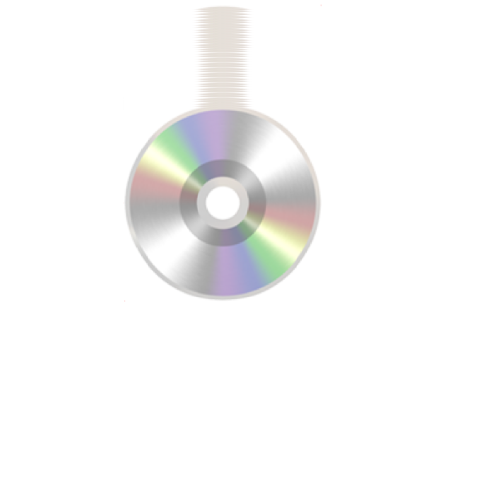

## Chrome Emoji repaint issue

### Envs
+ OS: macOS High Sierra 10.13.5 (17F77)
+ Chrome: Version 67.0.3396.87 (Official Build) (64-bit)
+ Chromium: Version 69.0.3464.0 (Official Build) canary (64-bit)

### Steps to reproduce
+ https://watilde.github.io/chrome-repaint-cd

### Screenshot

